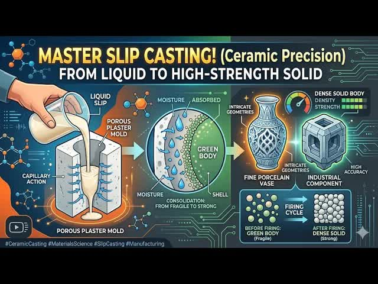

# 13-Ceramic-Casting-Methods：-Slip-Casting,-Pressure-Casting,-Tape-Casting

  <picture>
    
  </picture>

 

---

## Video Information

| Property | Value |
|----------|-------|
| **Video Name** | `13-Ceramic-Casting-Methods：-Slip-Casting,-Pressure-Casting,-Tape-Casting` |
| **Original Link** | [YouTube Video](https://www.youtube.com/watch?v=5d4UqiT0jpM) |
| **Total Size** | **1 file** - **7.82 MB** |
| **Quality** | **best** |
| **Status** | **Complete (100%)** |
| **Password Protected** | **NO** |

---

---

## Subtitles

| # | File | Link |
|---|------|------|
| 1 | `subtitle.zip` | [Download](https://raw.githubusercontent.com/goldenguardrd/youtube/main/videos/13-Ceramic-Casting-Methods%EF%BC%9A-Slip-Casting%2C-Pressure-Casting%2C-Tape-Casting/subtitle.zip) |

> Contains all available subtitle languages.

## Download Links

| # | File | Link |
|---|------|------|
| 1 | `13-Ceramic-Casting-Methods：-Slip-Casting,-Pressure-Casting,-Tape-Casting.mp4` | [Download](https://raw.githubusercontent.com/goldenguardrd/youtube/main/videos/13-Ceramic-Casting-Methods%EF%BC%9A-Slip-Casting%2C-Pressure-Casting%2C-Tape-Casting/13-Ceramic-Casting-Methods%EF%BC%9A-Slip-Casting%2C-Pressure-Casting%2C-Tape-Casting.mp4) |

---

## How to Extract

Ready to use — no extraction needed!

---

*This tool created by [avasam.ir](https://avasam.ir)*
