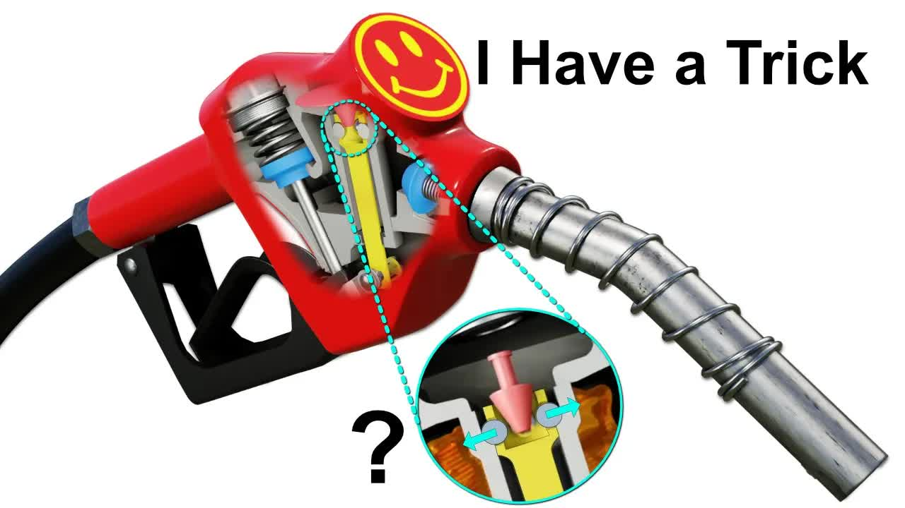

# How-does-a-Gas-Nozzle-KNOW-when-to-shut-off？

  <picture>
    
  </picture>

 

---

## Video Information

| Property | Value |
|----------|-------|
| **Video Name** | `How-does-a-Gas-Nozzle-KNOW-when-to-shut-off？` |
| **Original Link** | [YouTube Video](https://www.youtube.com/watch?v=UKiiiCEU8fw&list=PLuUdFsbOK_8oiTXoONBIdF0vErGSGZbWs&index=2) |
| **Total Size** | **3 parts** - **117.89 MB** |
| **Quality** | **1080** |
| **Status** | **Complete (100%)** |
| **Password Protected** | **NO** |

---

## Download Links

> Download **all parts**, then open `How-does-a-Gas-Nozzle-KNOW-when-to-shut-off？.zip` — the other parts are found automatically.

| # | File | Link |
|---|------|------|
| 1 | `How-does-a-Gas-Nozzle-KNOW-when-to-shut-off？.z01` | [Download](https://raw.githubusercontent.com/goldenguardrd/youtube/main/videos/How-does-a-Gas-Nozzle-KNOW-when-to-shut-off%EF%BC%9F/How-does-a-Gas-Nozzle-KNOW-when-to-shut-off%EF%BC%9F.z01) |
| 2 | `How-does-a-Gas-Nozzle-KNOW-when-to-shut-off？.z02` | [Download](https://raw.githubusercontent.com/goldenguardrd/youtube/main/videos/How-does-a-Gas-Nozzle-KNOW-when-to-shut-off%EF%BC%9F/How-does-a-Gas-Nozzle-KNOW-when-to-shut-off%EF%BC%9F.z02) |
| 3 | `How-does-a-Gas-Nozzle-KNOW-when-to-shut-off？.zip` | [Download](https://raw.githubusercontent.com/goldenguardrd/youtube/main/videos/How-does-a-Gas-Nozzle-KNOW-when-to-shut-off%EF%BC%9F/How-does-a-Gas-Nozzle-KNOW-when-to-shut-off%EF%BC%9F.zip) |

---

## How to Extract

| OS | Steps |
|----|-------|
| **Windows** | Double-click `How-does-a-Gas-Nozzle-KNOW-when-to-shut-off？.zip` — opens in Explorer, WinRAR, or 7-Zip |
| **Mac** | Double-click `How-does-a-Gas-Nozzle-KNOW-when-to-shut-off？.zip` — extracts with Archive Utility |
| **Linux** | `unzip How-does-a-Gas-Nozzle-KNOW-when-to-shut-off？.zip` or right-click → Extract Here |
| **Android** | Tap `How-does-a-Gas-Nozzle-KNOW-when-to-shut-off？.zip` in file manager or use ZArchiver |

---

*This tool created by [avasam.ir](https://avasam.ir)*
